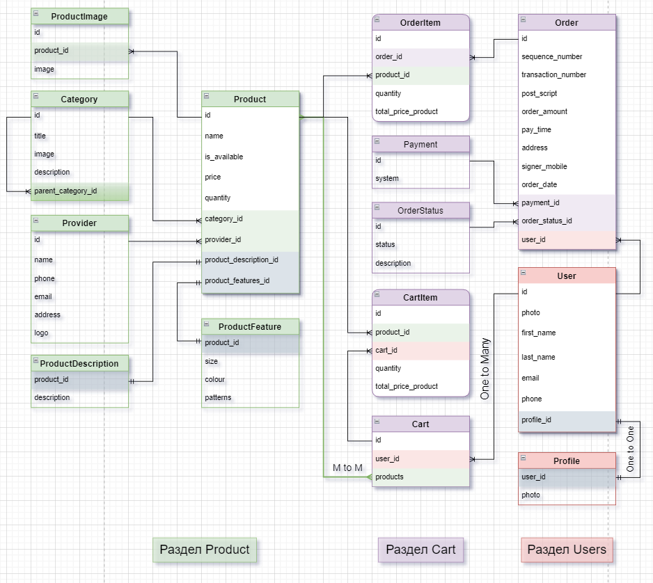

# _Online Store_


>_Language: [Русский](README.md), [English](README.en.md)_ 

### 📃 Content
1. ✏️ [Project description](#project_desc)
   - 📋 [Tasks](#goals)
   - 📟 [Functionality](#func_abilities)
2. 📱 [Project technologies](#project_technologies)
3. 📚 [Dependencies used](#dependencies_used)
4. 📈 [Relationships between tables](#table)
5. 🔌 [Installation and launch](#installation_and_launch)
   - 📔 [Installing the project in the IDE](#installation_ide)
   - 🐳 [Installing the project in Docker](#installation_docker)
6. 📗 [API Documentation](#documentation_api)
7. 🔐 [License](#license)

<a name="project_desc"></a>
## ✏️ Description of the project ##
A project based on the Django Rest Framework, designed to show the interaction
of the "**Online Store**" with the _Buyer_, _Manager_ / _Admin_, and _Provider_.

<a name="goals"></a>
### 📋 Tasks ###
The project was developed with the aim of exploring the Django Rest Framework.\
Topics such as:
- Patterns of _MVC_, _MVP_. ✅
- Authentication _JWT_. ✅
- Authentication _sessions_. ✅
- Integration. ✅
- Registration via _SMTP_ protocol. ✅
- Registration, authorization using _Djoser_. ✅
- Optimization by connecting _phone tasks_. ✅
- Optimization using _Cache_. ✅
- The work of _queue brokers_ (Redis, RabbitMQ, Kafka). ✅
- The difference between _RabbitMQ_ and _Kafka_, the pros and cons of using them. ✅

<a name="func_abilities"></a>
### 📟 Functional features ###
- Users: 💁
  - Registration:
    - User registration.
    - Request for a new password by email.
  - Authorization:
    - Password change.
    - User activation.
    - Password reset.
  - JWT authentication
    - Token creation.
    - Token update.
    - Token verification.
  - User:
    - View profile
    - Change the profile.
- Categories: 📂
  - View:
    - View category, subcategory.
    - View the list of categories and their subcategories.
  - Adding:
    - Adding categories, subcategories. (_admin_ / _Manager_)
  - Change:
    - Change of category, subcategory. (_Admin_ / _Manager_)
  - Delete:
    - Deleting categories, subcategories. (_Admin_ / _Manager_)
  - Search:
    - Search by category.
    - Search by subcategories. \[**In development**]
- Products: 🍫
  - View:
    - View the product.
    - View the list of products.
  - Adding:
    - Add an item. (_Admin_ / _Manager_ / _Provider_)
  - Change:
    - Change the product. (_Admin_ / _Manager_ / _Provider_)
  - Delete:
    - Delete the product. (_Admin_ / _Manager_ / _Provider_)
  - Search:
    - Product search.
- Providers: 👷
  - View:
    - View the provider.
    - View the list of suppliers.
  - Adding:
    - Add a supplier. (_Admin_ / _Manager_)
  - Change:
    - Change the supplier. (_Admin_ / _Manager_ / _Provider_)
  - Delete:
    - Delete the supplier. (_Admin_ / _Manager_ / _Provider_)
  - Search:
    - Search by suppliers.
- Carts: 📲
  - View:
    - View the cart
    - View the list of baskets. (_Admin_ / _Manager_)
  - Adding:
    - Add an item to the cart.
  - Change:
    - Change the item in the shopping cart.
  - Delete:
    - Delete an item from the shopping cart.
    - Empty the trash. \[**In development**]
- Orders: 📝
  - View:
    - View the order.
    - View the list of orders.
  - Adding:
    - Place an order.
  - Change:
    - Change the order status. (_Admin_ / _Manager_) \[**In development**]
  - Delete:
    - Delete the order.

<a name="project_technologies"></a>
## 📱 Project technologies ##
- Scheme - `Spectacular`.
- Registration - `SMTP`.
- Sending messages - `Djoser`.
- Error tracking - `Sentry`.
- Address verification via - `Google Maps`. **(In development)**
- Database Backup - `CeleryBeat`.
- Caching and Database - `Redis`.
- Background tasks - `Celery`.
- Queue broker - `RabbitMQ`.

<a name="dependencies_used"></a>
## 📚 Dependencies used ##
- `Python 3.11`
- `Django 4.2.7`
- `djangorestframework 3.14.0`
- `djangorestframework-simplejwt 5.3.0`
- `drf-spectacular 0.26.5`
- `djoser 2.2.2`
- `psycopg2 2.9.9`
- `redis 5.0.1`
- `rabbitmq-server 0.0.1`
- `celery 5.3.6`
- `django-celery-beat 2.5.0`
- `sentry-sdk 1.38.0`

<a name="table"></a>
## 📈 Relationships between tables ##


<a name="installation_and_launch"></a>
## 🔌 Installation and launch ##
> [!WARNING]
> If you **have** all the following on your computer, you can skip this warning.
> - You may need to install [Sentry](https://sentry.io)
> - You may need to install [Redis](https://redis.io/docs/install/install-redis/)
> - You may need to install [RabbitMQ](https://www.rabbitmq.com/#getstarted)

<a name="installation_ide"></a>
### 📔 Installing the project in the IDE ###
- Cloning the repository:
```text
git clone https://github.com/AntonVagabond/online_store.git
```
- Creating a virtual environment and installing dependencies:
```text
python3.11 -m venv env
source env/bin/activate
pip install -r requirements.txt
```
- Creating `.env` based on `.env.example`
```.env
SECRET_KEY=
DEBUG=
ALLOWED_HOSTS=

PG_DATABASE=
PG_USER=
PG_PASSWORD=
DB_HOST=
DB_PORT=

SENTRY_DSN=

EMAIL_HOST=
EMAIL_PORT=
EMAIL_HOST_USER=
EMAIL_HOST_PASSWORD=
EMAIL_USE_TLS=
```

<a name="installation_docker"></a>
### 🐳 Installing the project in Docker ###
- Build of the project:
```docker
docker-compose up -d --build
```
- Creating migrations:
```docker
docker exec web python manage.py makemigrations
```
- Application of migrations:
```docker
docker exec web python manage.py migrate
```
- Initialization of the project:
```docker
docker-compose exec make initial
```
- Adding a superuser:
```
docker-compose exec web python manage.py createsuperuser
```

<a name="documentation_api"></a>
## 📗 API Documentation ##
API documentation is available at `/api/v1'.

<a name="license"></a>
## 🔐 License ##
For details, see the LICENSE file.