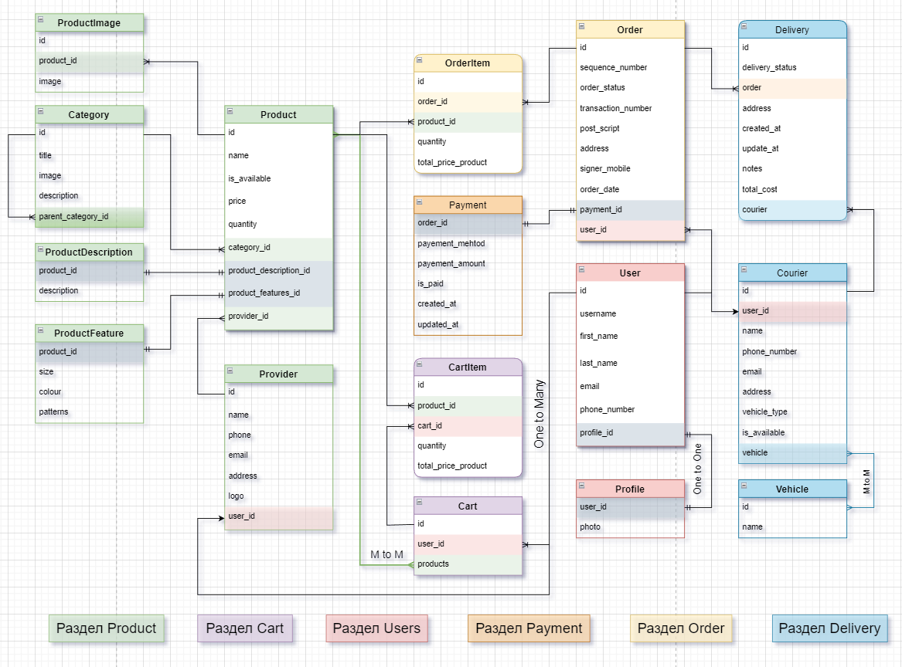

# _Online Store_
[](https://www.python.org)
[](https://www.djangoproject.com)
[](https://www.django-rest-framework.org)
[](https://swagger.io)
[](https://www.postgresql.org)\
[](https://docs.celeryq.dev/en/stable/)
[](https://redis.io)
[](https://www.rabbitmq.com)
[](https://sentry.io)
[![Static Badge](https://img.shields.io/badge/yookassa-blue?logo=data%3Aimage%2Fpng%3Bbase64%2CiVBORw0KGgoAAAANSUhEUgAAACAAAAAgCAYAAABzenr0AAAClklEQVR4AWIYumAU1AF4rQdYuYIoAMOntm3bjmvbbVC3wbPj2o3aoI5quw1r27a5etb0z325q%2BzcfZ7kWw7OHWeJRNoEsOtFIOI3%2FklhJb9GbKV4b46hmIcwLMRotCOA8p68%2F%2BCS%2FKcIh0jCL7PxshiGnXiNZGRBIRtp%2BIzjmEEgVXN6xElZh%2BZprJiFo4wub4GtcEAhmFScQj%2BJ%2BmsEQEDuALqhh4VuqAKBoBeuQ%2BXDe0ySBHPeEAwfruIvfgfwB58xAIKOuAtVAN8w2hjOqF9GABuDdR%2BG0G0VeT8CVQgeo62xgvgwAnaLzCkYjNlIhyokmyTKXlr4UAc3LTImYzouQFlIwyOcw004oSx8RV%2BRKJfwYYNFRhfWB%2BmlD5iPeiiH6hiFG1Aa2VhtzuzRSNFkTMQlZEMF8A%2FjIQF0wTMojetmxoZ4ajEJf0Jp7GYylTYbNVIU7xHgnd%2FioTR%2BCRlhK8mXbZpMWciA0giDSLjfXh%2Fu7oWBcGnKpnOoJJkZZyIjHwGEQ3gI8Ulhf816B1gEkEY3OcyMLfEuf0PgKA3PEIQTTOhfcwhioTR%2BiJEojDL8sD%2Bfk3ACJIBOeAKlccn%2FQFqEbM0ydARZhgv8luFwXA2yDJf4B9AZ3zQb0cU8bkQOKAsf0cP%2FWK6A08W0FdOrzpJeAdgQcNKkFMFhdA8tEPBi0hc277WKYRB0wB2oAviMYcbFZkpGwLteJURiLVZjOdr4XUiuQeXDG4yVCFdOXWFOi8tmhBfv228U6D5sgT0PV7Lj6C3RNnedeU5GwWjkBFKW9yEWl9JUfMZRTEMVo3y4AyhQinR49ZRxLW%2BGIZjrfS0nyLYoZ%2BY1Go6x%2FR8VOyZ5oODE0zEphOL8Z%2BAgH5RgFAAAnJyfQ6tNOroAAAAASUVORK5CYII%3D&labelColor=white)
](https://yookassa.ru)
[![Static Badge](https://img.shields.io/badge/webhook-%23ff0066?logo=data%3Aimage%2Fpng%3Bbase64%2CiVBORw0KGgoAAAANSUhEUgAAAFwAAABcCAMAAADUMSJqAAAAn1BMVEX%2F%2F%2F9LS0vHOmPFO2PJOWNBQUE%2BPj7HOmXHOmFISEhMSktEREQ6OjrLy8vJOWXFO2H4%2BPjf39%2Bqqqru7u6Xl5e6urrExMRlZWVRUVHU1NRycnJ6enr47fDHMmBfX1%2Fo6OiDg4OhoaHDJlngn7DlsL7Rc4z15Onpxc6Pj4%2FdlakyMjLqz9bmt8PMUnTVlqfOX3%2FVgZfQaofbjKDFAk%2FJRW747MY5AAAHe0lEQVRoge1YaXeiShCVpRs7ICKgCNoqbdzjmGT8%2F7%2FtVW%2BsGp%2BSb%2B%2FVnJkTmc61upZbt%2Bj1%2FrdONj99rA%2BH9cdp%2FtvIpz9nyhgFY4yd%2F5x%2BEfr9zKhpWY7jWKbj%2BCZll49fgt5dGfUdxwSz%2BT%2FwHY7Pzr%2Fh%2FfyT%2BWANcMex2XfQFXt7ZqbvA6RlNsxh546pPTFqg9%2FD4dDs2xD2KrhD6baT39S0FXi%2Fb0OoIT4VeN%2FvgD73RTR80%2B7bFmX%2B9Xp1KBSOLa4A1WNar0fmQgEGDNxn18OOAwXzj0%2BL%2BZbKAt28ir1mjgKn%2FrpSGvM1pTLBUJLvr2HP%2Fzq%2BbYPXNrs0bj%2B%2FUMuGcA0di71WkBsqysO2b919Qy0OPhyy71ewt4zXHsSbfqknwWgwGGlHL9S3ARwK9JWcHpgtGtK%2BSrwoniKE3elqJD7OHdvuD4Fw6CtRv9oSnEkSGR8RMcCIe4zFg528meWfn8feMl%2BA04v4mHtGYXglHp0luMOe76R3Jjy32U76bVQMC98%2FmGQz9jz9bqhwXEY8QEbNPB73wOJc0O%2F3n6%2BXswi4asFQgr%2B9KXB3Jr%2Ff4uDm5Wlw0Zxw5zX%2FkJC65wZZwtNvKtrXvz6LPfcVOA95ZDTNG%2FR4WqwhbwTnaXBqSnBeiCO3CY7HncAVMwnP2%2BCeAu9zRn46LIFl8WpxBOtBWN4a4Ck8%2FkMFOH0%2BoWdOh6ZDP%2FmHhNTByTSCp590yKe1PPKUbTg4mKjzHNXB3T0%2F8ukIzfFCE62ZBJflguvgOBVngtP64rC%2Fz7f%2FCbiFzzJb8FLo1cBJeW6%2BOzyNzVnRNMs2imvoaPACYNXWzBSl7kvODV1UtilZdFRboFnErPB9KtCjPCGexsdhR9c%2FObpIqr%2BTT4LJQtMj7uh6wCyNLuPObY%2BrxdjB3pnWbhb70vWWKSpwRx3RvwR7CbPZQU75pQqMpPQONteKi%2F9lSr3EqMK6XezElC4HdD2HI6LLsSM46AcNzopGDHGF0zvZu6hH8P9a1F4wlb4To%2BveshGNZMlxp2yiqADF3bBlWGyz0IvC9LxGS%2FFxmabp6PEtgsHKW1Y%2FW7YCr9FqqjtpNQpnxvHoed7xiGbhT6UfhFPP9appOjC%2BFcIka%2BiemeokAsq0ZDOMkvG9C4wRhuuSSnNsBbYDKrpxNKrTexX%2FZgkF2VFG0iufbSggw1bVHmQxuo0Ov560gzOaarr2Uv1sx5UmyDXzq3U8mjY1WOm913Q%2BxS7RJZDrh%2BA1B7duaeQxvgcO7uW1oyNMiAYnmXq4ZkOolH4rm9Luuw7o1QaIjMoE8zKZ8S0dChFr%2BzeXnkGRU4K9I%2FypTEHDqwyqrEwPMnTENhSkNwT83qYpy5FgNwvTKIrScOGV8CVlhuVTvNeFumOmwLbvibUR4tDVyk6zIhEF70S4CDeeFCevQ%2BG4ze6%2BtNkjb9Hg9NJNpMbgXoOTqW79%2BfbAJPgPO2xktCXAwNXoR1Hukc6EVJeQye8r%2B8vk8PSdH1ZYtZ%2BOV1m2GkcKXUfGXYmrqGwSyXHBJ6N8i7PlYH4oMnPMW8TFrsrWWFcR4l%2Bn%2BVPGe35WWkiIOev6iEnLHKKp7HstD%2Fig0tNcElZw5hsadKYENx%2B9TplVGpWILaxYQzigHiuSUr6ZxFbgD97VjJIaf7mJ%2FEKd06CXu6ow%2BfMts%2Fgmwl8c%2Blw%2BS%2BmfhtryPJc%2FjMfjME5QgwIkZU3UbWATVt%2FjCjo4UEt5LotFVnl4RC3DGLktdiHC9eBYJHFRhr%2FXu9Tf7sEI4iIxRG9vb02gm%2BaKglSxQmFvqu4geu3aAt%2F0ymJ9bDJxqv7cvKcfS3C%2FCc7nRNxaQ%2B%2BCDyoZhUgrz1VYWuDc89m%2FBxeeZ4XnC%2FmTnD%2FftAEuhHnrtcJdk02u5gjEXN1BysoT4yyrjav%2BLScolU2CG9a8kdKmulrGsL%2FKH4%2Bi0S%2B0HfKB2nBJNqhbGjcGqazztGxLPa5QKLvIroHz0RwrcNRm2KTmu3Jc599dVuS2cP2D%2BXpVsXyhPgOiihy3BcmSVNJBkKRwLYKTChWo7e8D9nmO7fiMCmUb4jduqv2a7FLG3VU7u5bvQgNrKpBvxYB0Nz4Do9eDuEoksd%2FuaP1ghTifg46bSXZeaj6XF502JhGs8%2Bv1%2BynQYdW1cofaQegmSaFwg4VGkxctZoe7iFq%2FOiu22rz1f7328UCPCsNTs75oEkIm9bMlYZNpy%2FFg1lrSo%2FK8ztColBs4S8ujyxgV6WovhhwIT2uCfGIU53GBU3mbQvAiHo%2BWy9Ekz7BwQ4Qct7bxVAARbMSpjE40TnApripqcVUdhUj2th4zHNxtleFEyx8Y%2FGSRzbKFW0IbblY9O%2FtBEfNMNwOe11YLUmrkm%2BdndxYRbqhdReHx%2FnHDnTbP594dYiXqdXndBs3hXBqetTtiYtycZsi9vYWPktuRJN7N1TeIcdMdSO7%2BruYKUdsbcmvfkraMYRElJbI3zZd3jnKLYoJJ3ZVk8sP5YLBPZC0iksSDR0oxGGeEKxgwhNE0Th%2Bch9%2Fgu3y6%2FJevJIJ0HK9Wq30%2B6fpe6j9j%2FwD5lYkvr7iQ0wAAAABJRU5ErkJggg%3D%3D&labelColor=white)
](https://www.mango-office.ru/products/calltracking/for-marketing/osnovy/webhook-i-kak-ego-ispolzovat/)


>_Language: [Русский](README.md), [English](docs/README.en.md)_ 🌍

### 📃 Содержание
1. ✏️ [Описание проекта](#project_desc)
   - 📋 [Задачи](#goals)
   - 📟 [Функциональные возможности](#func_abilities)
2. 📱 [Технологии проекта](#project_technologies)
3. 📚 [Используемые зависимости](#dependencies_used)
4. 📈 [Связи между таблицами](#table)
5. 📽️ [Пример работы](#example_work)
6. 🔌 [Установка и запуск](#installation_and_launch)
   - 📔 [Установка проекта в IDE](#installation_ide)
   - 🐳 [Установка проекта в Docker](#installation_docker)
7. 📗 [Документация API](#documentation_api)
8. 🔐 [Лицензия](#license)

<a name="project_desc"></a> 
## ✏️ Описание проекта ##
Проект на Django Rest Framework, предназначенный показать взаимодействия
"**Онлайн Магазина**":  
>_Покупателем_, _Менеджером_ / _Админом_, _Поставщиком_ и _Курьером_.

<a name="goals"></a>
### 📋 Задачи ###
Проект был разработан с целью изучения Django Rest Framework.\
Были изучены такие темы, как:
- Паттерны _MVC_, _MVP_. ✅
- Аутентификация _JWT_. ✅
- Аутентификация _sessions_. ✅
- Интеграция. ✅
- Регистрация по _SMTP_-протоколу. ✅
- Регистрация, авторизация с помощью _Djoser_. ✅
- Оптимизация с помощью подключения _фоновых задач_. ✅
- Оптимизация с помощью _Кэша_. ✅
- Работа _брокеров очередей_ (Redis, RabbitMQ, Kafka). ✅
- Разница между _RabbitMQ_ и _Kafka_, плюсы и минусы их использования. ✅
- Работа с платежной системой _Yookassa_. ✅
- Применение _webhook-а_. ✅

<a name="func_abilities"></a> 
### 📟 Функциональные возможности ###
Примерный список [конечных точек](docs/endpoints/Endpoints.md) и их возможности.


<a name="project_technologies"></a>
## 📱 Технологии проекта ##
- Схема - `Spectacular`.
- Регистрация - `SMTP`.
- Отправка сообщений - `Djoser`.
- Отслеживание ошибок - `Sentry`.
- Проверка адреса через - `Google Maps`. **(в разработке)**
- Резервная копия Базы Данных - `CeleryBeat`.
- Кэширование и База Данных - `Redis`.
- Фоновые задачи - `Celery`.
- Брокер очередей - `RabbitMQ`.
- Платежная система - `Yookassa`.
- Подтверждение платежа - `Webhook`.

<a name="dependencies_used"></a>
## 📚 Используемые зависимости ##
- `Python 3.11`
- `Django 4.2.7`
- `djangorestframework 3.14.0`
- `djangorestframework-simplejwt 5.3.0`
- `drf-spectacular 0.26.5`
- `djoser 2.2.2`
- `psycopg2 2.9.9`
- `redis 5.0.1`
- `rabbitmq-server 0.0.1`
- `celery 5.3.6`
- `django-celery-beat 2.5.0`
- `sentry-sdk 1.38.0`
- `yookassa 3.0.1`

<a name="table"></a>
## 📈 Связи между таблицами ##


<a name="example_work"></a>
## 📽️ Пример работы. ##
1. Пример работы [копирования Базы Данных](docs/videos/Postman_t9M2iW3Xku.mp4) вы можете скачать и посмотреть.
2. Пример работы [Оформления заказа и его оплата в Yookassa](docs/videos/pycharm64_Jr15ACpje5.mp4) вы можете скачать и посмотреть.

<a name="installation_and_launch"></a>
## 🔌 Установка и запуск ##
> [!WARNING]
> Если на вашем компьютере **есть** всё нижеперечисленное, то можете _пропустить_ это предупреждение.
> - Может понадобиться регистрация в [Sentry](https://sentry.io).

<a name="installation_ide"></a>
### 📔 Установка проекта в IDE ##
- Клонирование репозитория:
```text
git clone https://github.com/AntonVagabond/online_store.git
```
- Создание виртуального окружения и установка зависимостей:
```text
python3.11 -m venv env
source env/bin/activate
pip install -r requirements.txt
```
- Создание `.env` на основе `.env.example`
```.env
SECRET_KEY=
DEBUG=
ALLOWED_HOSTS=

PG_DATABASE=
PG_USER=
PG_PASSWORD=
DB_HOST=
DB_PORT=

SENTRY_DSN=

EMAIL_HOST=
EMAIL_PORT=
EMAIL_HOST_USER=
EMAIL_HOST_PASSWORD=
EMAIL_USE_TLS=

REDIS_HOST=
REDIS_PORT=

RABBIT_HOST=
RABBIT_PORT=

CELERY_TASK_TRACK_STARTED=
ACCEPT_CONTENT=
RESULT_SERIALIZER=
TASK_SERIALIZER=
TIMEZONE=

YOOKASSA_SHOP_ID=
YOOKASSA_SECRET_KEY=
YOOKASSA_RETURN_URL=

STATIC_FILES=/path/to/static/
MEDIA_FILES=/path/to/media/
```

<a name="installation_docker"></a>
### 🐳 Установка проекта в Docker ###
- Билд проекта:
```docker
docker-compose up -d --build
```
- Создание миграций:
```docker
docker exec web python manage.py makemigrations
```
- Применение миграций:
```docker
docker exec web python manage.py migrate
```
- Инициализация проекта:
```docker
docker-compose exec make initial
```
- Добавление superuser-а:
```
docker-compose exec web python manage.py createsuperuser
```

<a name="documentation_api"></a>
## 📗 Документация API ##
Документация по API доступна по `/api/v1`.

<a name="license"></a>
## 🔐 Лицензия ##
Подробности см. в файле [LICENSE](LICENSE).