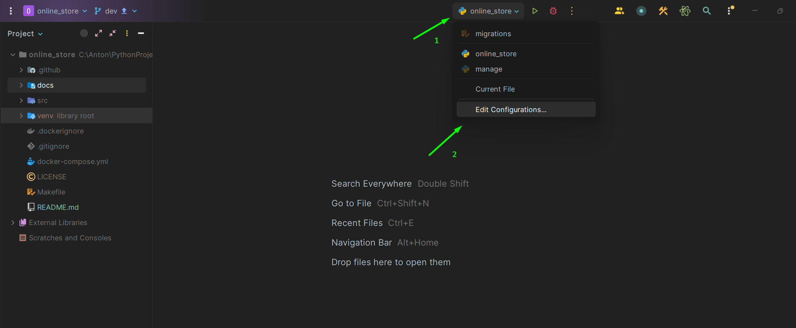
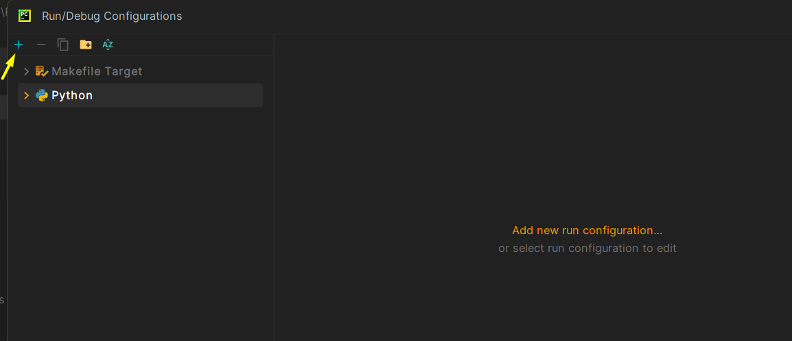
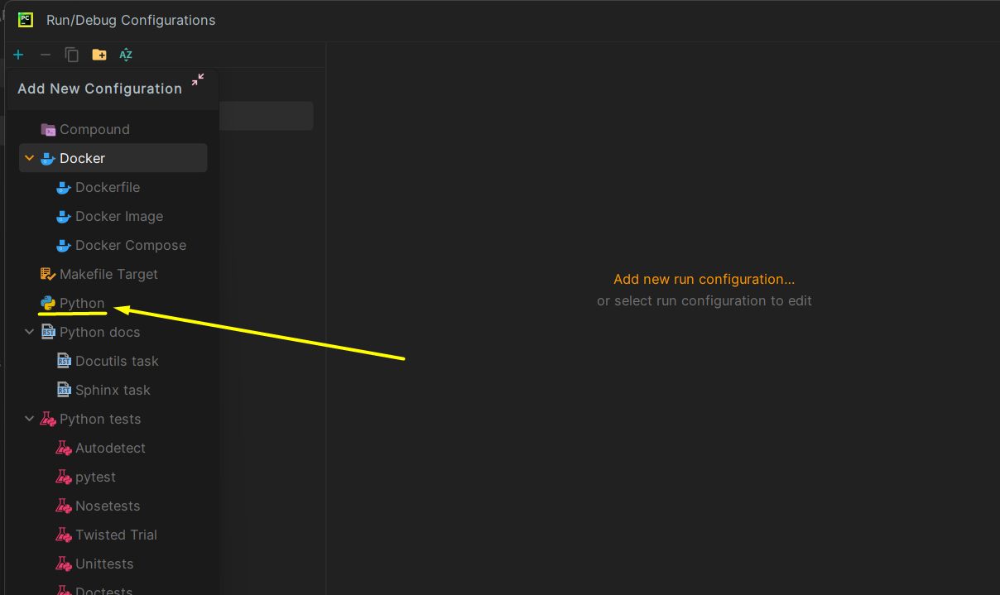
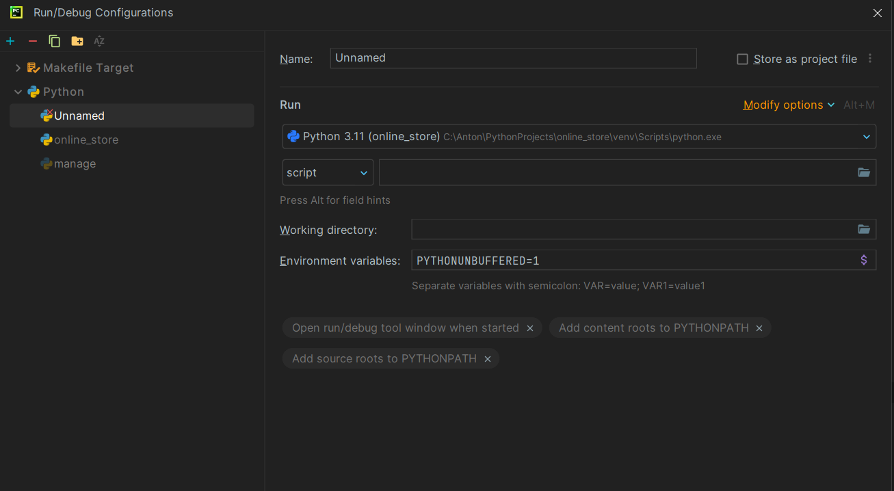
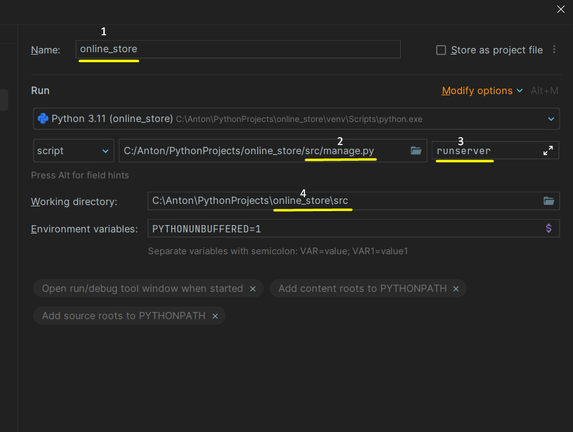

For more convenient operation, you can apply the configuration of the automatic launch of the project. \
Do not crawl into the terminal every time and do not write this exhausted command - _python manage.py runserver_.

## 📃 Instructions for configuring the project configuration.

1. The first thing to do is to find and click on the Configuration Settings section. \
It looks like this:

---
2. After that, you will see an empty Configuration settings window. \
You will need to click on the "+" in the upper left corner of the configuration window:

---
3. Next, you need to add the configuration **_Python_**:

---
4. When you do this, you will see an empty configuration section:

---
5. It will need to be edited as follows:

---
Now you have everything ready!