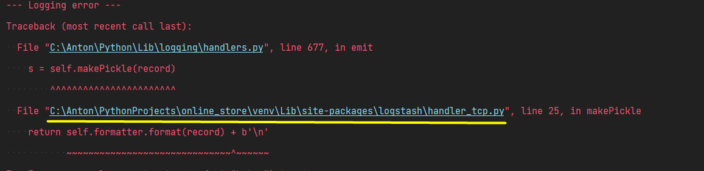
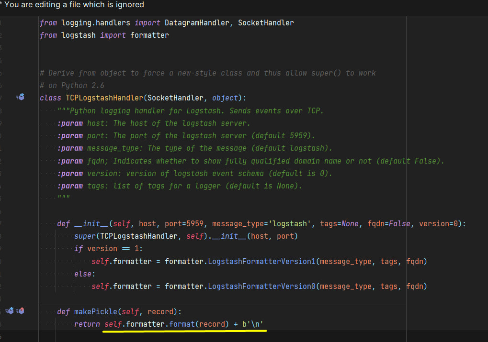
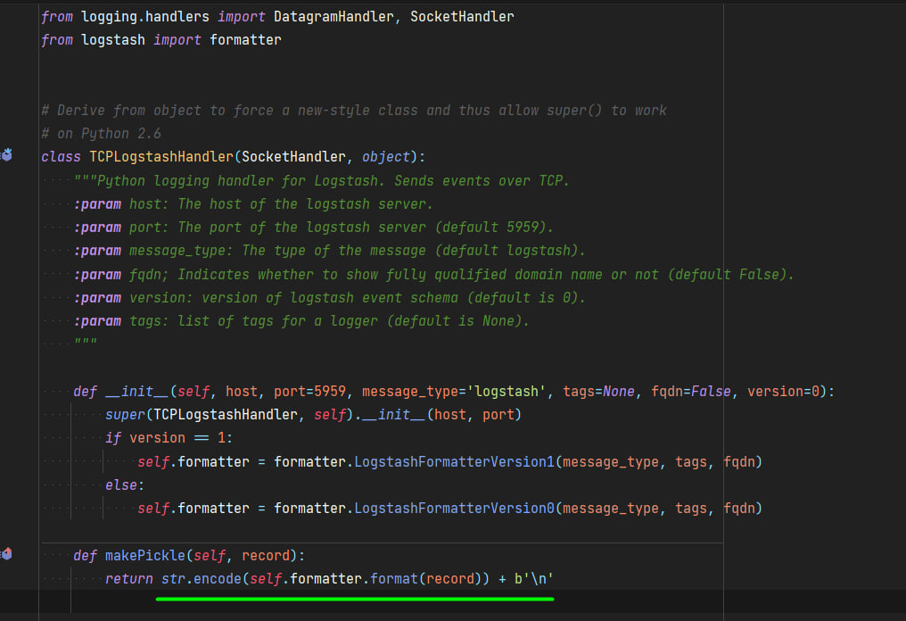

When the project is launched, when you log into _swagger_, that is, into the documentation, you may get an error. \
This is caused with an encoding problem. This can be solved as follows.

> For more information about why this error may occur, you can read this [link](https://github.com/vklochan/python-logstash/issues/77).

---
#### 1. Find the file with the encoding error in the console. The path looks like this. And go into it:

---
#### 2. There you will see the following code, you will need to fix the moment that is highlighted in yellow:

---
#### 3. You need to fix it for this:
