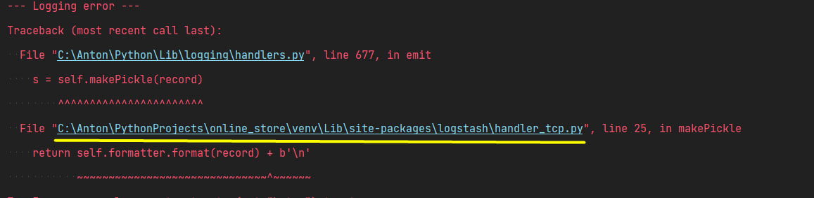

Когда запускается проект, при входе в _swagger_, то есть в документацию, у вас может выскочить ошибка. \
Это вызвано с проблемой кодировки. Это можно решить следующим образом.

> Более подробно почему может возникнуть эта ошибка, можете почитать по этой [ссылке](https://github.com/vklochan/python-logstash/issues/77).

---
#### 1. Найдите в консоли файл с ошибкой кодировки. Путь выглядит так. И зайдите в него:

---
#### 2. Там вы увидите такой код, вам нужно будет исправить момент, который выделен желтым:

---
#### 3. Его вам нужно исправить на это:

