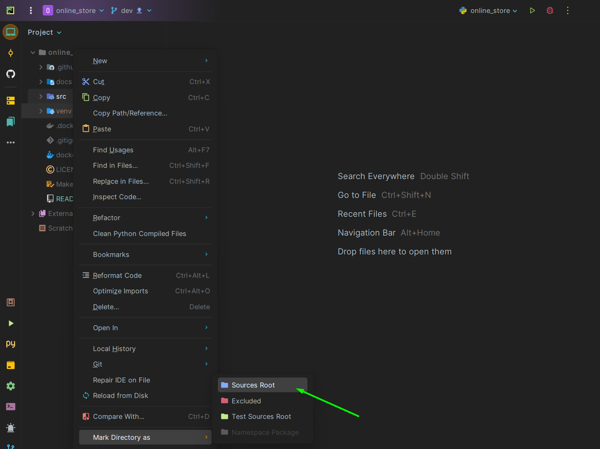

When starting a project, you need to specify the root of the project. This should be the **_src_** directory.
To do this, you will need a couple of actions:

---
1. Right-click on the **_src_** directory and find the _Mark Directory as_ section.
And click on **Sources Root**. It looks like this:

---
2. Next, you will need to go to the **src** directory in the console by typing the _cd src_ command. And it's already **starting** the project.